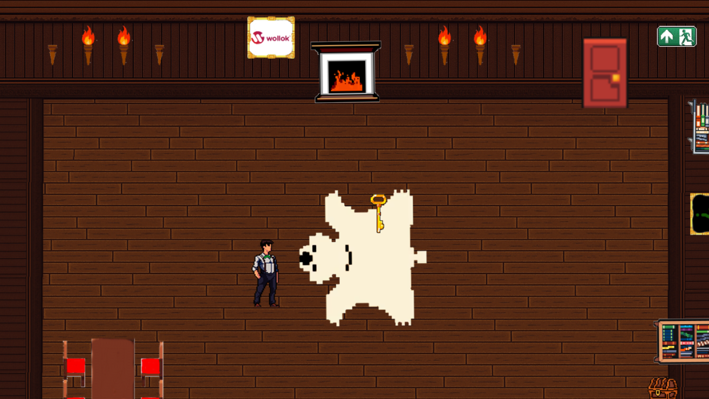
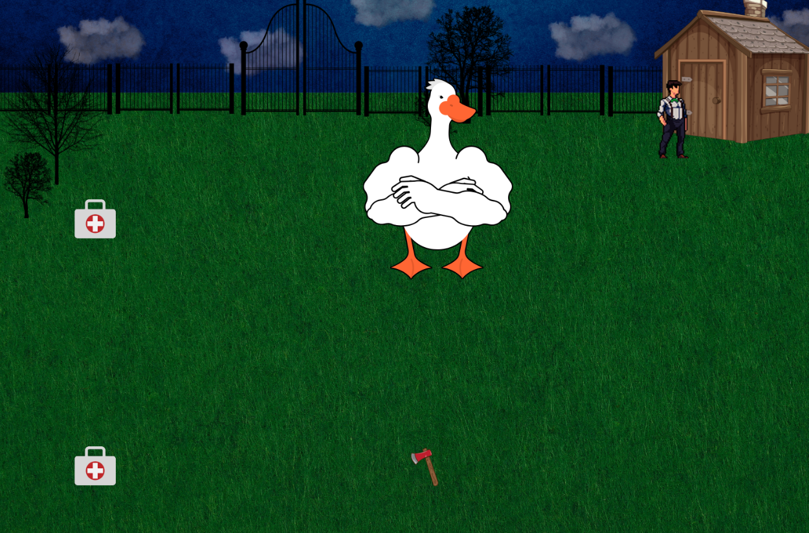

## LA ULTIMA CLAVE

Un juego creado por:

- Sebastian Castignani  
- Martina Surget

---

<h2>
  
  Historia
</h2>

Los patos han evolucionado hasta usar cuchillos para cazar humanos. Nuestro protagonista ha buscado refugio en una casa que parecía segura, pero al intentar salir descubre que ha quedado atrapado en su interior. Para poder escapar deberá resolver acertijos, encontrar claves ocultas y abrirse paso entre los peligros patos asesinos 

Cuando logre salir, la amenaza continuará: el exterior está lleno de patos asesinos que rondan por la zona. Tu objetivo es sobrevivir, matando a cada uno de ellos.  
   
***- Prepárate para una experiencia en la que cualquier error podría costarte la huida -***  
---

<h2>
  
  Imágenes
</h2>

  
  

---

<h2>
  
  Reglas de juego
</h2>

- Resolve el acertijo para salir de la casa.  
- asesina a todos los patos para poder escapar.  
- Al chocar con los distintos objetos, estos reaccionarán de diversas formas que te ayudarán o entorpecerán tu progreso.

---

<h2>
  
  Controles
</h2>

- Utiliza las teclas `W`, `A`, `S`, `D` para moverte por el mapa.  
- Cada colisión con los objetos puede desencadenar un efecto diferente.

---

<h2>
  
  Consejos
</h2>

- Presta atencion a cada pista dada.  
- Cuando tengas poca vida usa los botiquines que estan en el mapa.

